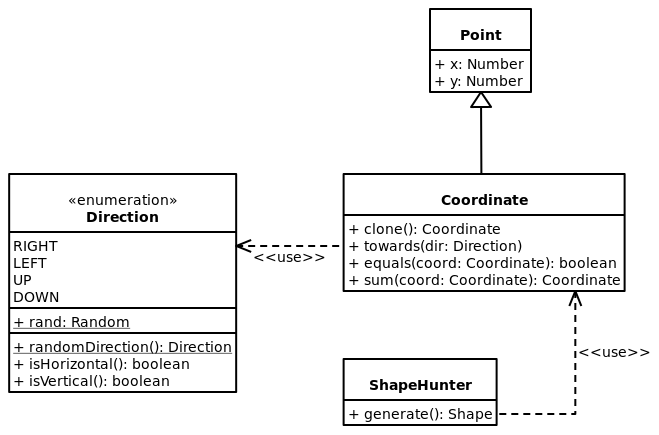
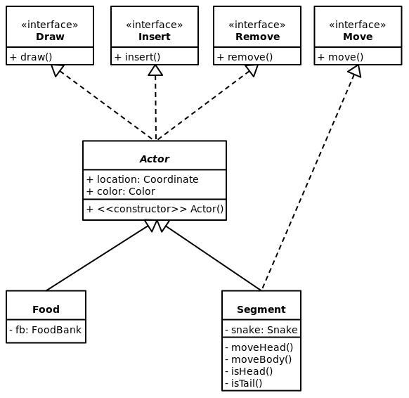
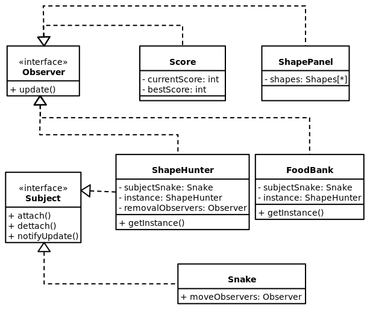
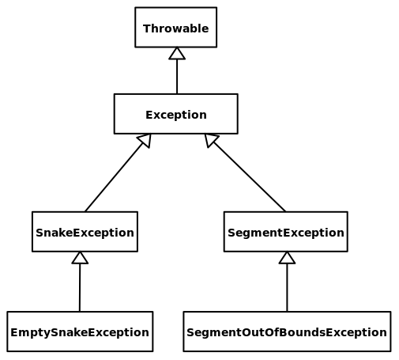
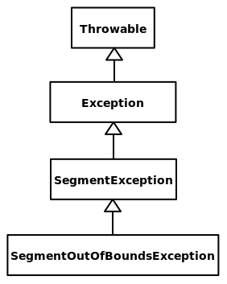

# Projeto `Snetrix`

<!-- vim-markdown-toc GFM -->

* [Descrição Resumida do Projeto/Jogo](#descrição-resumida-do-projetojogo)
* [Equipe](#equipe)
* [Arquivo Executável do Jogo](#arquivo-executável-do-jogo)
* [Slides do Projeto](#slides-do-projeto)
    * [Slides da Prévia](#slides-da-prévia)
    * [Slides da Apresentação Final](#slides-da-apresentação-final)
* [Relatório de Evolução](#relatório-de-evolução)
* [Diagrama da Arquitetura do Jogo](#diagrama-da-arquitetura-do-jogo)
* [Destaques de Código](#destaques-de-código)
    * [Destaque de Algoritmo](#destaque-de-algoritmo)
        * [Diagrama](#diagrama)
        * [Código](#código)
        * [Justificativa](#justificativa)
    * [Destaques de Orientação a Objetos](#destaques-de-orientação-a-objetos)
        * [Diagrama](#diagrama-1)
        * [Código](#código-1)
        * [Justificativa](#justificativa-1)
    * [Destaques de *Design Pattern*](#destaques-de-design-pattern)
        * [Diagrama](#diagrama-2)
        * [Código](#código-2)
        * [Justificativa](#justificativa-2)
* [Detalhamento das Interfaces](#detalhamento-das-interfaces)
    * [Interface `Draw`](#interface-draw)
    * [Interface `Insert`](#interface-insert)
    * [Interface `Remove`](#interface-remove)
    * [Interface `Move`](#interface-move)
    * [Interface `Observer`](#interface-observer)
    * [Interface `Subject`](#interface-subject)
* [Plano de Exceções](#plano-de-exceções)
    * [Diagrama da hierarquia de exceções](#diagrama-da-hierarquia-de-exceções)
    * [Descrição das classes de exceção](#descrição-das-classes-de-exceção)
* [Conclusões e Trabalhos Futuros](#conclusões-e-trabalhos-futuros)

<!-- vim-markdown-toc -->

# Descrição Resumida do Projeto/Jogo


O jogo Snetrix foi criado a partir da junção de dois jogos clássicos: Snake e
Tetris. Durante o jogo, o usuário deve, por meio das setas de seu teclado,
movimentar a cobra para que a mesma se alimente de comidas de cores
pré-estabelecidas, a fim de formar com seu corpo um formato específico mostrado
na tela. Ao fazê-lo, a cobra perde a parte do corpo que formou o formato e o
usuário pontua. O jogo termina em três condições: quando a cobra forma um
formato que inclui sua cabeça (ou seja, a cobra desaparece), quando a cobra
colide consigo mesma e quando a cobra encosta em uma das bordas do espaço de
jogo. O *framework* gráfico escolhido para o jogo foi o JSwing.

# Equipe
* Luiza Coelho de Souza - 247257
* Pedro Sader Azevedo - 243245

# Arquivo Executável do Jogo

[📁 snetrix.jar](snetrix.jar)

# Slides do Projeto

## Slides da Prévia
[🔗 Link](https://docs.google.com/presentation/d/1VjUHh6TvXTcX7MuGttllpbNoGelKi59lC5gMIKN51RE/edit#slide=id.p)

## Slides da Apresentação Final
[🔗 Link](https://docs.google.com/presentation/d/1AYmHwLMVmCIzhkl_hy9OlpR2MiHO1PmSlwrjADaJJ_M/edit#slide=id.p)

# Relatório de Evolução

Inicialmente, ao desenharmos o jogo no papel, tomamos algumas decisões sobre como seriam certos componentes do jogo e como eles se comportariam. Haviamos decidio implementar a Snake e o Shape como uma matriz, sendo cada bloco com uma coordenada, cor e componente. Logo percebemos que essa não seria a melhor maneira de contruir estas classes, já que uma sequência dos componentes seria importante, e, dessa forma, decidimos utilizar uma implementação de ArrayList. Ademais, haviamos pensado também que o Shape poderia ser identificado no meio da Snake, entretanto, durante a construção do código, percebemos que a maneira que estávamos construíndo possibilitaria a identificação na cauda da Snake, fazendo com que a identificação do Shape em qualquer parte da Snake torne-se uma possível melhoria.

Dividimos a construção do código em partes de maneira a verificar certos funcionamentos antes de implementar o código inteiro, a fim de evitar problemas futuros. Uma das primeiras coisas que foram construídas trata-se do ShapeGenerator, classe responsável por gerar os diversos formatos de Shape (o que difere do jogo Tetrix original, já que no jogo existem 7 formatos de Shape definido, enquanto no Snetrix eles são gerados aleatóriamente). Essa classe foi testada separadamente para checar sua funcionalidade, ao mesmo tempo determinando como seria sua interface gráfica (decisão pelo JSwing foi feita nesse momento). Nesta fase estavamos utilizando um JPanel apenas para representar os Shapes, sendo eles separados pelo seu tamanho, mas isso mudou ao longo do projeto. Com a necessidade de rodar os Shapes (quando o jogador consegue forma-lo no corpo da Snake, aquele Shape é removido da tela, a lista de Shapes translada para cima e um novo Shape aparece no final), percebemos que a melhor estratégia no momento seria criar JPanels separados para cada Shape, ou seja, mudando o caminho inicial de apenas um JPanel para todos os Shapes. Esses JPanels foram chamados de ShapeContainer, e os ShapeContainers se localizam dentro do ShapePanel.

A próxima grande etapa foi testar o movimento da Snake. Inicialmente não tivemos a ideia de primeiramente mover o corpo para depois mover a cabeça (o que não é instintivo), mas tornou-se claro que essa seria a melhor maneira de implementar o movimento, de modo que cada Segment da Snake sabia a coordenada do Segment anterior, ou seja, dando instruções para todos se moverem para o anterior e depois movendo a cabeça para a coordenada baseada no input do jogador tornou-se a melhor maneira de implementar esse aspecto do jogo. Após o movimento, focamos na implementação da alimentação da Snake, que é semelhante ao Snake original, e assim, o movimento da Snake estava pronto. Nesta etapa encontramos dificuldades em relação a certos aspectos que havíamos decidido implementar, como o uso do Singleton e Strategy. Como era algo que não havíamos utilizado antes, houve um período de adaptação a esses conceitos que trouxeram certas dificuldades, mas felizmente acabaram sendo resolvidos.

Após verificarmos a funcionalidade dos Shapes e da Snake, encontramos uma das principais etapas, como verificar se aquele Shape fazia parte da Snake. Para isso foi criada a classe ShapeHunter, uma das mais complexas e interessantes do jogo. Inicialmente, como mencionado, pensamos em identificar o Shape em toda a Snake, incluindo Segments que não eram seguidos, mas logo percebemos que essa seria uma implementação que requereria um tempo muito extenso e certas mudanças complexas em partes que já estavam funcionando, e, dessa forma, decidimos seguir pelo caminho da identificação pela cauda. O próximo problema encontrado em  relação ao ShapeHunter foi a ordem na qual o Shape era identificado. Percebemos que a maneira com a qual o Hunter estava funcionando não considerava que um Shape poderia ser formado de mais de uma forma (por exemplo, um shape de três blocos em seguida pode ser formado tanto da esquerda para direita quanto da direita para esquerda), o que dificultava sua formação correta pelo jogador, necessitando de várias tentativas. Assim, ao notarmos que o Shape era identificado apenas na ordem em que foi construído pelo ShapeGenerator, optamos pelo degradê de cores do Shape, que indicaria a ordem na qual o jogador deve formar. Com isso, conseguimos contornar o problema identificado, entretanto, essa seria uma possível alteração para melhoria no jogo.

Com isso, as principais mecânicas do Snetrix estavam prontas, mas ainda faltava certos aspectos a serem inseridos e problemas a serem lidados. Como exemplo, inicialmente tratamos que a remoção da cabeça da Snake seria uma exceção, ou seja, se o jogador formasse um Shape que incluísse a cabeça da Snake, seria um caso de uso de exceção. Entretanto, percebemos que esse caso poderia tornar-se na verdade uma mecânica do jogo, onde, caso o jogador removesse a cabeça da Snake, ele perderia. Ademais, a necessidade de um “Translador de Coordenadas” (método que translada uma coordenada referência para certa parte da Cobra a fim de possibilitar a checagem de um Shape em qualquer parte do tabuleiro, e não somente por volta de 0,0) também foi percebida cedo. Entretanto, sua implementação ocorreu durante a construção do ShapeHunter, o que acabou complicando também o processo, já que estávamos lidando com vários problemas ao mesmo tempo. Dessa forma, a checagem de certas funcionalidades de maneira separada (como foi feito com o ShapeGenerator) foi uma lição aprendida, pois, em certas ocasiões, tivemos problemas que não sabíamos de onde vinham, já que certos aspectos não haviam sido testados e estavam sendo assumidos como funcionais, quando, na verdade, o problema poderia estar vindo deles.

O uso do JSwing foi um projeto por sí só. Descobrir e aprender sua funcionalidade foi de certa maneira complexa, e em certas partes ofereceu obstáculos que não estávamos esperando. Inicialmente esperávamos implementar um JFrame (que seria a classe Game) e um JPanel, que chamávamos de GamePanel. Logo percebemos que daquela forma não funcionaria, de modo que haviam várias partes dinâmicas que precisavam se comunicar sem deixar o código confuso, descartando a ideia inicial. A partir desse momento, lidávamos com 3 JPanels, o ShapePanel, o SnakePanel e o ScorePanel. Como organizá-los, os tamanhos que seriam, cores, movimentos, foram sendo decididos conforme necessidade. A velocidade da Snake, a decisão da paleta de cores, os formatos, foram aspectos bem interessantes de decidir, que foram postos em prática após a implementação dos Panels. No geral, gostamos do uso do JSwing e do resultado final da interface gráfica do jogo, entretanto, com tempo disponível, seria possível explorarmos outras UI para “mudar a cara do jogo”

Por fim, acreditamos que lidamos bem com os problemas e adversidades que apareceram pelo caminho durante a implementação do jogo. Sua versão final ficou similar ao que enviosinavamos e pensávamos inicialmente, mesmo ocorrendo algumas mudanças que foram necessárias, tanto para melhor, quanto para pior. Com tempo, existem diversas mudanças que poderiam ser implementadas a fim de deixar o jogo ainda mais divertido.

# Diagrama da Arquitetura do Jogo


Neste diagrama pode-se perceber todos os componentes principais do jogo. A classe principal, `Game`, é por onde tudo se conecta, e a ela estão ligadas a classe `Controller` (a qual recebe e repassa os input pelo teclado do jogador) e os três principais `JPanels` do jogo. Esses `JPanel`s são: `ScorePanel` (ao qual esta ligado o `Score` e o coloca em display), `SnakePanel` (ao qual estão ligados todos os elementos e classes que se relacionam diretamente com a `Snake`) e `ShapePanel` (ao qual estão ligados todos os elementos e classes que se relacionam com os `Shape`s).

Também no diagrama estão presentes algumas das principais classes do jogo como `ShapeHunter` e `ShapeContainer`, os elementos da herança de `Actor` (`Segment` e `Food`) e elementos adicionais que foram necessários serem adicionados durante a construção do jogo, como um `JPanel` adicional, o `ShapeContainer`.

# Destaques de Código

## Destaque de Algoritmo

### Diagrama



### Código

```java
public Shape generate(int size, Color color) {
    ArrayList<Coordinate> blocks = new ArrayList<Coordinate>();
    Coordinate latestBlock = new Coordinate(0, 0);
    blocks.add(latestBlock);
    ...
    Coordinate newBlock;
    for (int i = 0; i < size; i++) {
        newBlock = latestBlock.clone();
        newBlock.towards(Direction.randomDirection());
        if (blocks.contains(newBlock)) {
            i--;
        } else {
            blocks.add(newBlock);
            latestBlock = newBlock;
            ...
        }
        ...
    return new Shape(blocks, color, width, heigth, minX, minY);
}

// sobrecarga
public Shape generate(int size) {
    return generate(size, RandomColor.generate());
}

// sobrecarga
public Shape generate(){
    Random rand = new Random();
    return generate(rand.nextInt(this.minSize, this.maxSize));
}
```

### Justificativa

O destaque algorítmico do projeto foi o código de geração de `Shape`s. Isso pode parecer trivial, mas tínhamos o desafio de gerar formatos que pudessem ser feitos pela `Snake` continuamente. Para esse propósito, escolhemos a representação de lista de coordenadas (`ArrayList<Coordinate>`) para as posições dos blocos dos `Shape`s, ao invés de matrizes.

Enfim, o algoritmo funciona simulando um percurso <u>válido</u> e <u>aleatório</u> de uma Snake. Para isso, ele começa inserindo a coordenada (0, 0) na lista e sorteia uma direção (`Direction`) para inserir uma nova coordenada a partir da última coordenada inserida. Isso é repetido até que seja atingido o tamanho desejado para o `Shape`. Por fim, sobrecarregamos o método acima para gerar `Shape`s de tamanho e cor aleatórios, caso estes não sejam fornecidos como parâmetros:

Incluímos também um diagrama de UML resumindo a interação das classes envolvidas nesse algoritmo. Nele, é possível perceber que alavancamos orientação a objetos nesse exemplo visto que delegamos diferentes etapas do algoritmo a diferentes objetos (geração de direção aleatória → `Direction`, geração de cor aleatória → `RandomColor`, geração de nova coordenada na direção especificada → `Coordinate`, etc).

## Destaques de Orientação a Objetos

### Diagrama



### Código

```java
public abstract class Actor implements Remove, Insert, Draw {
    private Coordinate location;
    private Color color;

    public Actor(){
        this.location = SnakePanel.getInstance().getRandomCoordinate();
        this.color = RandomColor.generate();
    }
```

### Justificativa

> Explicação de como a POO foi usada e quais suas vantagens, referenciando o diagrama.

O uso da classe abstrata `Actor` como generalização das peças individuais do jogo, `Segment` e `Food`, foi um bom exemplo de uso da orientação a objetos em nosso projeto. Ela nos permitiu o estabelecimento de um "molde" para as classes concretas, incluindo atributos (localização e cor), métodos (construtor sem parâmetros, *getters* e *setters*), e implementações (remoção, inserção, e renderização) comuns.

Para decidir o que incluir na classe abstrata, foi necessário decidir os aspectos comuns à todas as peças do jogo. Por exemplo: os `Segment`s se movem mas as `Food`s são estáticas, então a interface de movimento `Move` não é implementada pela classe abstrata parente de ambos. Assim, dentre elas, apenas a classe `Segment` implementa essa interface, como é possível observar no diagrama.

Mesmo este sendo um destaque de orientação a objetos, vale mencionar que as interfaces `Draw`, `Insert`, `Remove`, e `Move` são parte do *design pattern* de estratégia, que utilizamos profusamente em nosso código. Falaremos mais sobre elas na seção de [Detalhamento das Interfaces](#detalhamento-das-interfaces).

## Destaques de *Design Pattern*

### Diagrama



### Código

```java
@Override // Snake
public void notifyUpdate() {
    for (Observer obs : moveObservers) {
        obs.update();
    }
}
```

```java
@Override // ShapeHunter
public void notifyUpdate() {
    for (Observer obs : removalObservers) {
        obs.update();
    }
}
```

### Justificativa

O principal destaque de *design pattern* foi a utilização de observadores polimórficos. Isso foi implementado para duas situações a serem observadas: os movimentos realizados pela `Snake`, e as remoções realizadas pelo `ShapeHunter`.

No primeiro caso, o método de atualização da classe `FoodBank` verifica se a posição da cabeça da `Snake` coincide com a posição de alguma `Food` (se isso acontecer, a `Food` coincidente é removida e uma nova `Food` é gerada e posicionada). Além disso, o método de atualização da classe `ShapeHunter` verifica se a `Snake` formou algum `Shape` com o seu corpo (se isso acontecer, os `Segments` que integraram o formato são removidos).

No segundo caso, o método de atualização da classe `ShapePanel` remove o primeiro `Shape` da fila, desloca a fila, e requisita (à instância de `ShapeGenerator`) a geração de um novo `Shape` para ocupar o último lugar da fila. Além disso, o método de atualização da classe `Score` aumenta a pontuação do jogador.

Isso permitiu a criação de listas de tipo `Observer`, que podem ser iteradas para evocar polimorficamente os métodos de atualização dos objetos que as compoem.

Essa abordagem genérica tem como vantagem a facilidade de implementar novas respostas às situações observadas. Por exemplo, seria possível adicionar um objeto `ComboDetector` que observa cada movimento da `Snake` para detectar combinações de formatos em seu corpo.

# Detalhamento das Interfaces

## Interface `Draw`

Interface, do *design pattern* de estratégia, provida por qualquer objeto que precisa ser renderizado na tela do jogo.

```java
public interface Draw {
    public void draw(Graphics g);
}
```

Método | Objetivo
-------| --------
`draw` | Renderiza o objeto, usando métodos da classe `Graphics` (ex: `fillRect`, `fillOval`).

## Interface `Insert`

Interface, do *design pattern* de estratégia, provida por qualquer objeto que precisa interagir com outros objetos para inicializar todos os seus atributos propriamente. Os casos são:

- `Segment`: é inserido na lista de segmentos da `Snake` a qual ele pertence
- `Food`: é inserida na lista de comidas do `FoodBank` a qual ela pertence
- `FoodBank`: preenche a sua lista de comidas, construída vazia por padrão, com `Foods` de cor e posição aleatórias
- `Snake`: constrói e adiciona à sua lista de segmentos, construída vazia por padrão, um `Segment` para servir de cabeça.

```java
public interface Insert {
    public void insert();
}
```

Método | Objetivo
-------| --------
`insert` | Finaliza a inicialização dos atributos do objeto.

## Interface `Remove`

Interface, do *design pattern* de estratégia, provida por qualquer objeto que precisa interagir com outros objetos para ser retirado do jogo. Os casos são:

- `Segment`: precisa ser removido da lista de segmentos da `Snake`a qual pertence, além de "remendá-la" para manter a continuidade
- `Food`: precisa ser removida da lista de comidas do `FoodBank`a qual pertence

```java
public interface Remove {
    public void remove();
}
```

Método | Objetivo
-------| --------
`remove` | Realiza interações necessárias para retirada do objeto do jogo.

## Interface `Move`

Interface, do *design pattern* de estratégia, provida por qualquer objeto que precisa se mover.

```java
public interface Move {
    public void move();
}
```

Método | Objetivo
-------| --------
`move` | Move o objeto. Note que esse método não contém parâmetros, então a especificações do movimento (ex: direção, velocidade) precisam ser "decididas" pelo próprio objeto.

## Interface `Observer`

Interface, do *design pattern* de observador, provida por qualquer objeto que desempenha o papel de observador.

```java
public interface Observer {
    public void update();
}
```

Método | Objetivo
-------| --------
`update` | Atualiza o estado do objeto observador.

## Interface `Subject`

Interface, do *design pattern* de observador, provida por qualquer objeto que desempenha o papel de observado.

```java
public interface Subject {
    public void attach(Observer obs);
    public void dettach(Observer obs);
    public void notifyUpdate();
}
```

Método | Objetivo
-------| --------
`attach` | adiciona um objeto ao registro de observadores a serem notificados.
`dettach` | remove um objeto do registro de observadores a serem notificados.
`notifyUpdate` | notifica os observadores registrados.

# Plano de Exceções

## Diagrama da hierarquia de exceções

Plano inicial | Plano final
----- | ----- 
 | 

## Descrição das classes de exceção

Classe | Descrição | Implementada
----- | ----- | ------
`SegmentException` | Engloba todas as exceções relacionadas à classe Segment. Usamos ela diretamente quando o método `moveHead()`, da class Segment, é chamado em um Segment que não é a cabeça da Snake. | ✔️
`SegmentOutOfBoundsException` | Indica tentativa de acesso a um segmento fora do alcance. Muitas vezes foi chamado a partir do `catch` de um `IndexOutBoundsException`. | ✔️
`SnakeException` | Engloba todas as exceções relacionadas à classe Snake. | ❌
`SnakeException` | Indica situação em que Snake fica com a sua lista de Segments vazia. Decidimos não implementar isso como excessão, pois tornou-se uma mecânica do jogo e, portanto, uma situação esperada | ❌

# Conclusões e Trabalhos Futuros

Acreditamos que nosso projeto Snetrix teve um resultado ótimo e dentro do esperado, mas encontramos diversas dificuldades durante o caminho e tivemos que seguir caminhos diferentes do que pensavamos inicialmente.

O uso do JSwing como interface gráfica foi interessante, por um lado conseguimos aprender o necessário para fazer o jogo rodar e ser construído com a estética que esperavamos (o JSwing tornou o uso de Data desnecessário, já que todos os formatos foram desenhados com funções próprias do JSWing, como DrawRect) mas por outro lado, é um dos principais pontos a serem melhorados. Com mais estudo e tempo seria possivel criar classes separadas para Model e View (enquanto no jogo atual esses dois aspectos estão juntos, o o codigo um pouco longo), deixando o jogo com classes menores e mais organizadas, com o objetivo definido para cada uma tratando-se de JSwing.

O uso do Singleton também foi algo controverso, já que de certa maneira entendemos sua funcionalidade mas ocasionou em uma construção complicada do código, havendo que sempre notar as instância e suas atualizações.

Para ideias futuras no jogo temos alguns aspectos em mente. Melhorias no sistema de pontuação seriam a primeira ideia, a qual necessitaria de uma identificação dos Shapes sem contar a ordem (já que hoje eles são detectados na cauda), ou seja, o Shape não precisaria ser formado de uma forma contínua. Para isso poder ser realizado, deveria ocorrer uma mudança na classe ShapeHunter, mudando o método como o Shape é encontrado. A implementação de combos na pontuação, perda de pontos por algo feito, e mudanças do tipo também são possíveis melhorias a serem documentadas.

A implementação de um Multiplayer também seria algo possível, podendo ser cooperativo ou competitivo, que deixaria o jogo com um aspecto interessante. 

Além disso, estratégias de favorecimento (como chances de spawnar Foods da cor do Shape atual ou criar Shape da cor que tiver mais Foods) também é viável, e poderia auxiliar o jogador em certos casos.

Por fim, outra mudança possível seria de interface gráfica, devido as limitações do JSwing, escolher um interface gráfica que possibilitasse a criação de um jogo com uma estética realista juntamente com a criação de um menu inicial seria uma possível melhoria futura. No geral, acreditamos que nosso jogo é algo interessante e inovador, que conseguiu cumprir com o que imaginávamos para ele inicialmente, aplicando os conceitos de POO durante diversos momentos de sua criação
